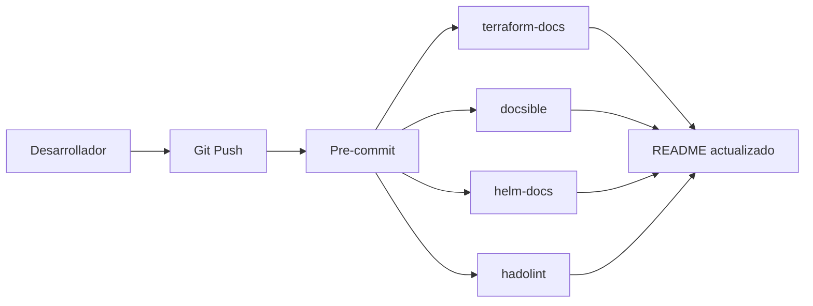

# Guía de Testing en Docker - Sistema de Documentación

Esta guía te permite probar el sistema completo de documentación en un contenedor Docker aislado, sin instalar nada en tu máquina excepto Docker.

---

## 🎯 Por Qué Usar Docker para Testing

### Ventajas ✅

1. **Aislamiento Total**
   - No instala nada en tu sistema
   - No conflictos con versiones existentes
   - Puedes destruir y recrear en segundos

2. **Ambiente Reproducible**
   - Todas las herramientas preinstaladas
   - Mismas versiones para todo el equipo
   - Funciona igual en Windows, Mac, Linux

3. **Seguridad**
   - Pruebas sin riesgo
   - Sandbox completo
   - Fácil de limpiar

4. **Rapidez**
   - No necesitas instalar ~10 herramientas
   - Todo listo en 1 comando
   - Imagen reutilizable

### Desventajas ⚠️

1. **Tamaño de imagen**: ~1.5GB (pero se descarga una sola vez)
2. **Requiere Docker Desktop**: Necesitas tener Docker instalado
3. **Performance**: Ligeramente más lento que nativo (pero imperceptible)

**Veredicto:** ✅ **Sí, es óptimo para testing**

---

## 📋 Prerrequisitos

Solo necesitas Docker instalado:

### Windows

```powershell
# Instalar Docker Desktop
# https://docs.docker.com/desktop/install/windows-install/
winget install Docker.DockerDesktop
```

### Mac

```bash
# Instalar Docker Desktop
brew install --cask docker
```

### Linux

```bash
# Ubuntu/Debian
sudo apt-get update
sudo apt-get install docker.io docker-compose

# Fedora
sudo dnf install docker docker-compose

# Agregar tu usuario al grupo docker
sudo usermod -aG docker $USER
# Cerrar sesión y volver a entrar
```

**Verificar instalación:**

```bash
docker --version
docker-compose --version
```

---

## 🚀 Quick Start (5 minutos)

### Método 1: Docker Compose (Recomendado)

```bash
# 1. Crear carpeta para testing
mkdir docs-testing
cd docs-testing

# 2. Descargar archivos necesarios
# Copiar Dockerfile.testing y docker-compose.testing.yml aquí

# 3. Iniciar contenedor
docker-compose -f docker-compose.testing.yml up -d

# 4. Acceder al contenedor
docker-compose -f docker-compose.testing.yml exec docs-testing bash

# ¡Listo! Ya estás dentro del contenedor con todas las herramientas
```

### Método 2: Docker Directo (Más simple)

```bash
# 1. Build de la imagen
docker build -f Dockerfile.testing -t docs-testing .

# 2. Ejecutar contenedor
docker run -it --rm \
  -v $(pwd):/workspace \
  -p 8000:8000 \
  docs-testing

# ¡Listo! Ya estás dentro
```

---

## 🧪 Pruebas Paso a Paso

Una vez dentro del contenedor, sigue estos pasos:

### Paso 1: Verificar Herramientas (2 min)

```bash
# Verificar que todo está instalado
echo "=== Python Tools ==="
python3 --version
pip3 --version
mkdocs --version
pre-commit --version

echo "=== Terraform Tools ==="
terraform-docs --version

echo "=== Ansible Tools ==="
docsible --version

echo "=== Kubernetes Tools ==="
helm-docs --version
kubeval --version

echo "=== Docker Tools ==="
hadolint --version
dive --version

echo "=== Diagram Tools ==="
dot -V
inframap --help | head -1

# Si todos responden, ¡estás listo! ✅
```

### Paso 2: Crear Proyecto de Prueba (5 min)

```bash
# Crear estructura básica
mkdir -p test-project/{terraform/modules/vpc,ansible/roles/webserver,kubernetes/helm/myapp,docker}
cd test-project

# Inicializar git (requerido para pre-commit)
git init
git config user.email "test@example.com"
git config user.name "Test User"
```

### Paso 3: Probar Terraform Docs (5 min)

```bash
# Crear un módulo Terraform de ejemplo
cd terraform/modules/vpc

cat > main.tf <<'EOF'
# VPC Module for Azure
# Creates a Virtual Network with subnets

variable "resource_group_name" {
  description = "Name of the resource group"
  type        = string
}

variable "location" {
  description = "Azure region"
  type        = string
  default     = "eastus"
}

variable "vnet_name" {
  description = "Name of the VNet"
  type        = string
}

variable "address_space" {
  description = "Address space for VNet"
  type        = list(string)
  default     = ["10.0.0.0/16"]
}

resource "azurerm_virtual_network" "main" {
  name                = var.vnet_name
  location            = var.location
  resource_group_name = var.resource_group_name
  address_space       = var.address_space
}

output "vnet_id" {
  description = "ID of the created VNet"
  value       = azurerm_virtual_network.main.id
}

output "vnet_name" {
  description = "Name of the created VNet"
  value       = azurerm_virtual_network.main.name
}
EOF

# Crear configuración de terraform-docs
cat > .terraform-docs.yml <<'EOF'
formatter: markdown table
header-from: main.tf
sections:
  show:
    - header
    - requirements
    - providers
    - inputs
    - outputs
    - resources
output:
  file: README.md
  mode: inject
  template: |-
    <!-- BEGIN_TF_DOCS -->
    {{ .Content }}
    <!-- END_TF_DOCS -->
sort:
  enabled: true
  by: required
EOF

# Generar documentación
terraform-docs markdown table . > README.md

# Ver resultado
cat README.md

# ✅ Deberías ver una tabla con inputs, outputs, etc.
```

### Paso 4: Probar Ansible Docs (5 min)

```bash
cd /workspace/test-project/ansible/roles/webserver

# Crear estructura de rol
mkdir -p {tasks,defaults,vars,meta,templates}

cat > defaults/main.yml <<'EOF'
---
# Defaults for webserver role
nginx_port: 80
ssl_enabled: false
worker_processes: auto
EOF

cat > tasks/main.yml <<'EOF'
---
- name: Install NGINX
  apt:
    name: nginx
    state: present
    update_cache: yes

- name: Configure NGINX
  template:
    src: nginx.conf.j2
    dest: /etc/nginx/nginx.conf
  notify: restart nginx

- name: Ensure NGINX is running
  service:
    name: nginx
    state: started
    enabled: yes
EOF

cat > meta/main.yml <<'EOF'
---
galaxy_info:
  author: DevOps Team
  description: NGINX web server setup
  company: Your Company
  license: MIT
  min_ansible_version: 2.9
  platforms:
    - name: Ubuntu
      versions:
        - focal
        - jammy
dependencies: []
EOF

# Generar documentación
docsible generate --role-path . --output-file README.md

# Ver resultado
cat README.md

# ✅ Deberías ver variables, tasks, etc.
```

### Paso 5: Probar Helm Docs (5 min)

```bash
cd /workspace/test-project/kubernetes/helm/myapp

# Crear estructura básica de Helm chart
mkdir templates

cat > Chart.yaml <<'EOF'
apiVersion: v2
name: myapp
description: A Helm chart for my application
type: application
version: 1.0.0
appVersion: "1.0"
maintainers:
  - name: DevOps Team
    email: devops@company.com
EOF

cat > values.yaml <<'EOF'
# Default values for myapp

# -- Number of replicas
replicaCount: 3

image:
  # -- Container image repository
  repository: myregistry.azurecr.io/myapp
  # -- Image pull policy
  pullPolicy: IfNotPresent
  # -- Image tag (defaults to chart appVersion)
  tag: ""

service:
  # -- Service type
  type: ClusterIP
  # -- Service port
  port: 80

ingress:
  # -- Enable ingress
  enabled: true
  # -- Ingress class name
  className: "nginx"

resources:
  # -- Resource limits
  limits:
    cpu: 500m
    memory: 512Mi
  # -- Resource requests
  requests:
    cpu: 250m
    memory: 256Mi
EOF

cat > templates/deployment.yaml <<'EOF'
apiVersion: apps/v1
kind: Deployment
metadata:
  name: {{ include "myapp.fullname" . }}
spec:
  replicas: {{ .Values.replicaCount }}
  selector:
    matchLabels:
      app: myapp
  template:
    metadata:
      labels:
        app: myapp
    spec:
      containers:
      - name: myapp
        image: "{{ .Values.image.repository }}:{{ .Values.image.tag }}"
        ports:
        - containerPort: 80
EOF

# Generar documentación
helm-docs

# Ver resultado
cat README.md

# ✅ Deberías ver tabla de values
```

### Paso 6: Probar Hadolint (Docker) (5 min)

```bash
cd /workspace/test-project/docker

# Crear un Dockerfile de ejemplo
cat > Dockerfile <<'EOF'
FROM node:18-alpine AS builder

WORKDIR /app

COPY package*.json ./
RUN npm ci --only=production

COPY . .
RUN npm run build

FROM nginx:alpine

COPY --from=builder /app/build /usr/share/nginx/html

EXPOSE 80

HEALTHCHECK --interval=30s --timeout=3s \
  CMD wget --quiet --tries=1 --spider http://localhost/health || exit 1

USER nginx

CMD ["nginx", "-g", "daemon off;"]
EOF

# Lint del Dockerfile
hadolint Dockerfile

# Si hay warnings/errors, los verás aquí
# ✅ Si no hay output, todo está bien
```

### Paso 7: Probar MkDocs (10 min)

```bash
cd /workspace/test-project

# Crear sitio MkDocs
cat > mkdocs.yml <<'EOF'
site_name: Test Documentation
theme:
  name: material
  language: es
  palette:
    - scheme: default
      primary: indigo
      toggle:
        icon: material/brightness-7
        name: Modo oscuro
    - scheme: slate
      primary: indigo
      toggle:
        icon: material/brightness-4
        name: Modo claro
  features:
    - navigation.instant
    - navigation.tabs
    - search.suggest
    - content.code.copy

plugins:
  - search:
      lang: es
  - mermaid2

markdown_extensions:
  - pymdownx.highlight
  - pymdownx.superfences:
      custom_fences:
        - name: mermaid
          class: mermaid
          format: !!python/name:pymdownx.superfences.fence_code_format
  - admonition

nav:
  - Inicio: index.md
  - Terraform: terraform/modules/vpc/README.md
  - Ansible: ansible/roles/webserver/README.md
  - Kubernetes: kubernetes/helm/myapp/README.md
EOF

# Crear página principal
mkdir -p docs
cat > docs/index.md <<'EOF'
# Test Documentation

Este es un sitio de prueba para el sistema de documentación automatizado.

## Stack Cubierto

- **Terraform**: Infraestructura como código
- **Ansible**: Gestión de configuración
- **Kubernetes**: Orquestación de contenedores
- **Docker**: Containerización

## Herramientas Probadas

✅ terraform-docs
✅ docsible
✅ helm-docs
✅ hadolint
✅ MkDocs

## Diagrama de Ejemplo



EOF

# Servir el sitio (accesible en <http://localhost:8000>)

mkdocs serve -a 0.0.0.0:8000

# Abrir en tu navegador del host: <http://localhost:8000>

# ✅ Deberías ver el sitio funcionando

```

### Paso 8: Probar Pre-commit (5 min)

```bash
# Volver a la raíz del proyecto
cd /workspace/test-project

# Crear configuración de pre-commit
cat > .pre-commit-config.yaml <<'EOF'
repos:
  - repo: https://github.com/antonbabenko/pre-commit-terraform
    rev: v1.88.0
    hooks:
      - id: terraform_docs
        args:
          - --hook-config=--path-to-file=README.md
          - --hook-config=--add-to-existing-file=true

  - repo: local
    hooks:
      - id: hadolint
        name: Lint Dockerfiles
        entry: hadolint
        language: system
        files: Dockerfile.*
EOF

# Instalar pre-commit hooks
pre-commit install

# Probar en todos los archivos
pre-commit run --all-files

# ✅ Debería ejecutar terraform-docs y hadolint
```

---

## 📊 Ejemplo Completo: Workflow Real

```bash
# Dentro del contenedor

# 1. Hacer un cambio en Terraform
cd /workspace/test-project/terraform/modules/vpc
echo 'variable "tags" { description = "Tags"; type = map(string); default = {} }' >> main.tf

# 2. Commit (pre-commit se ejecuta automáticamente)
git add .
git commit -m "test: add tags variable"

# 3. Pre-commit actualiza README.md automáticamente
cat README.md  # Verás el nuevo variable "tags"

# 4. Ver cambios
git diff HEAD~1

# ✅ README.md se actualizó automáticamente
```

---

## 🎛️ Comandos Útiles

### Gestión del Contenedor

```bash
# Ver contenedores corriendo
docker ps

# Ver logs
docker-compose -f docker-compose.testing.yml logs -f

# Reiniciar contenedor
docker-compose -f docker-compose.testing.yml restart

# Detener contenedor
docker-compose -f docker-compose.testing.yml down

# Limpiar todo (incluyendo volúmenes)
docker-compose -f docker-compose.testing.yml down -v
```

### Dentro del Contenedor

```bash
# Ver herramientas instaladas
which terraform-docs docsible helm-docs hadolint dive mkdocs

# Ver espacio usado
du -sh /workspace

# Limpiar caches
rm -rf ~/.cache/pip ~/.cache/pre-commit

# Salir del contenedor
exit  # o Ctrl+D
```

### Acceso a Archivos

```bash
# Desde el host, los archivos están en:
ls -la ./test-project

# Se sincronizan automáticamente con el contenedor
# Puedes editar desde tu IDE favorito en el host
# Y ejecutar comandos en el contenedor
```

---

## 🐛 Troubleshooting

### Problema: "Cannot connect to Docker daemon"

**Causa:** Docker Desktop no está corriendo

**Solución:**

```bash
# Windows/Mac: Iniciar Docker Desktop desde el menú

# Linux:
sudo systemctl start docker
sudo systemctl enable docker
```

---

### Problema: "Port 8000 already in use"

**Causa:** Otro proceso está usando el puerto 8000

**Solución:**

```bash
# Cambiar puerto en docker-compose.testing.yml
ports:
  - "8001:8000"  # Usar puerto 8001 en el host

# O detener el proceso que usa 8000
lsof -i :8000  # Linux/Mac
netstat -ano | findstr :8000  # Windows
```

---

### Problema: "Permission denied" al acceder a archivos

**Causa:** Diferencia de UID entre host y contenedor

**Solución:**

```bash
# Dentro del contenedor, cambiar permisos
sudo chown -R devops:devops /workspace

# O en el host
sudo chown -R $USER:$USER ./test-project
```

---

### Problema: MkDocs serve es muy lento

**Causa:** Watch de archivos en volumen Docker puede ser lento

**Solución:**

```bash
# Usar --dirtyreload (más rápido pero menos preciso)
mkdocs serve -a 0.0.0.0:8000 --dirtyreload

# O deshabilitar auto-reload
mkdocs serve -a 0.0.0.0:8000 --no-livereload
```

---

### Problema: Imagen muy grande (>2GB)

**Causa:** Acumulación de capas y caches

**Solución:**

```bash
# Limpiar imágenes viejas
docker image prune -a

# Rebuild sin cache
docker-compose -f docker-compose.testing.yml build --no-cache

# Limpiar todo Docker
docker system prune -a --volumes  # ⚠️ Elimina TODO
```

---

## 🎓 Siguiente Pasos

Después de probar en Docker:

### 1. Si Todo Funciona Bien ✅

```bash
# Instalar en tu sistema real
./setup-docs-tools.sh

# O continuar usando Docker para desarrollo
# (recomendado si tienes múltiples proyectos)
```

### 2. Si Quieres Customizar la Imagen

```bash
# Editar Dockerfile.testing
vim Dockerfile.testing

# Rebuild
docker-compose -f docker-compose.testing.yml build --no-cache

# Test
docker-compose -f docker-compose.testing.yml up -d
```

### 3. Si Quieres Compartir con el Equipo

```bash
# Push imagen a tu registry
docker tag docs-testing myregistry.azurecr.io/docs-testing:latest
docker push myregistry.azurecr.io/docs-testing:latest

# El equipo puede usar:
docker pull myregistry.azurecr.io/docs-testing:latest
```

---

## 📋 Checklist de Testing Completo

```markdown
## Verificación de Herramientas
- [ ] Python 3.x funciona
- [ ] terraform-docs genera docs
- [ ] docsible genera docs
- [ ] helm-docs genera docs
- [ ] hadolint valida Dockerfiles
- [ ] dive analiza imágenes
- [ ] mkdocs serve funciona
- [ ] pre-commit se ejecuta

## Verificación de Workflows
- [ ] Pre-commit actualiza docs en commit
- [ ] MkDocs genera sitio correctamente
- [ ] Diagramas Mermaid renderizan
- [ ] Búsqueda funciona en MkDocs
- [ ] Navegación es intuitiva

## Verificación de Documentación
- [ ] README de Terraform generado
- [ ] README de Ansible generado
- [ ] README de Helm generado
- [ ] Dockerfile linteado sin errores
- [ ] Sitio docs accesible en localhost:8000
```

---

## 💡 Tips y Tricks

### Tip 1: Alias Útiles

Agregar a tu `.bashrc` (dentro del contenedor):

```bash
# Dentro del contenedor
cat >> ~/.bashrc <<'EOF'
alias docs-gen='terraform-docs markdown table . > README.md'
alias docs-serve='mkdocs serve -a 0.0.0.0:8000'
alias docs-build='mkdocs build'
alias lint-docker='find . -name "Dockerfile*" -exec hadolint {} \;'
alias lint-compose='find . -name "docker-compose*.yml" -exec docker-compose -f {} config --quiet \;'
EOF

source ~/.bashrc
```

### Tip 2: Script de Testing Rápido

```bash
# Crear script de testing rápido
cat > /workspace/test-all.sh <<'EOF'
#!/bin/bash
echo "🧪 Testing Documentation System..."

echo "1. Testing terraform-docs..."
cd /workspace/test-project/terraform/modules/vpc
terraform-docs markdown table . > /tmp/tf-test.md && echo "✅ terraform-docs OK" || echo "❌ FAIL"

echo "2. Testing docsible..."
cd /workspace/test-project/ansible/roles/webserver
docsible generate --role-path . --output-file /tmp/ansible-test.md && echo "✅ docsible OK" || echo "❌ FAIL"

echo "3. Testing helm-docs..."
cd /workspace/test-project/kubernetes/helm/myapp
helm-docs --dry-run && echo "✅ helm-docs OK" || echo "❌ FAIL"

echo "4. Testing hadolint..."
cd /workspace/test-project/docker
hadolint Dockerfile && echo "✅ hadolint OK" || echo "❌ FAIL"

echo "5. Testing mkdocs..."
cd /workspace/test-project
mkdocs build --quiet && echo "✅ mkdocs OK" || echo "❌ FAIL"

echo "🎉 Testing complete!"
EOF

chmod +x /workspace/test-all.sh

# Ejecutar
/workspace/test-all.sh
```

### Tip 3: Persistir Configuración

```bash
# Guardar configuración de git
git config --global user.email "tu@email.com"
git config --global user.name "Tu Nombre"

# Estas configs se guardan en el volumen y persisten entre reinicios
```

---

## 🎯 Conclusión

**¿Es óptimo usar Docker para testing?**

✅ **SÍ, absolutamente.**

**Ventajas clave:**

- Setup en 5 minutos vs 30-60 minutos manual
- Ambiente 100% reproducible
- Sin riesgo para tu sistema
- Fácil de compartir con el equipo
- Fácil de limpiar

**Cuándo usar Docker:**

- ✅ Testing inicial
- ✅ Demos al equipo
- ✅ CI/CD
- ✅ Desarrollo si tienes múltiples proyectos

**Cuándo instalar nativo:**

- ✅ Uso diario intensivo (mejor performance)
- ✅ Una sola laptop, un solo proyecto
- ✅ Ya tienes las herramientas instaladas

**Recomendación final:** Empieza con Docker para testing, si te gusta el sistema, instala nativo con `setup-docs-tools.sh`

---

**¿Listo para empezar?**

```bash
docker-compose -f docker-compose.testing.yml up -d
docker-compose -f docker-compose.testing.yml exec docs-testing bash
```

¡A probar! 🚀
