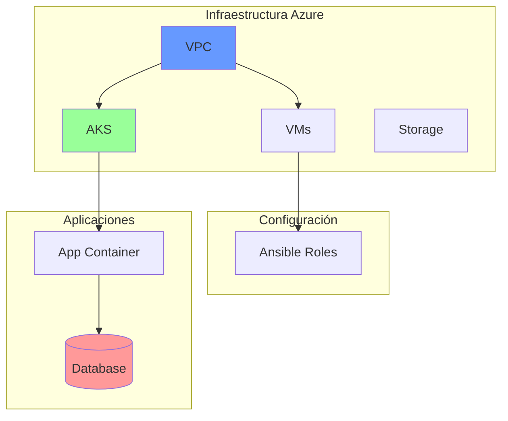

# Diagramas de Arquitectura

## Índice de Diagramas

### Infraestructura
- [Vista General de Infraestructura](./terraform/infrastructure-overview.md)
- [Dependencias Terraform](./terraform/dependencies.md)

### Aplicaciones
- [Flujo de Roles Ansible](./ansible/webserver-flow.md)
- [Arquitectura Docker](./docker/)

### Sistema Completo

