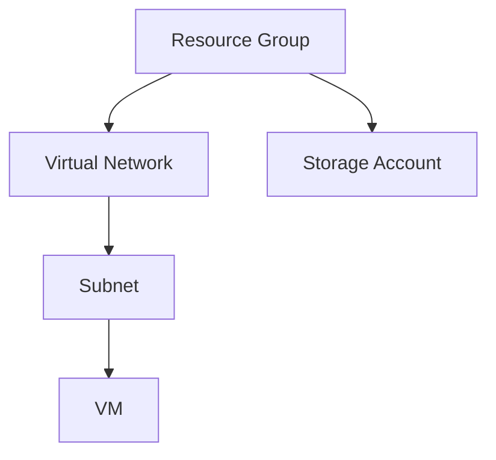

# Diagramas de Infraestructura

## Dependencias Terraform

```mermaid
graph TD
    A[Resource Group] --> B[Virtual Network]
    A --> C[Storage Account]
    B --> D[Subnet]
    D --> E[VM]
```

## Arquitectura Azure

