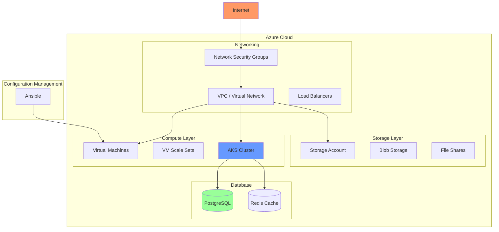

# Diagrama de Infraestructura

## Vista General

## Módulos Terraform

| Módulo | Descripción | Recursos |
|--------|-------------|----------|
| **VPC** | Red virtual y subnets | VNet, Subnets, NSG |
| **Compute** | Máquinas virtuales | VMs, NICs, Public IPs |
| **Storage** | Almacenamiento | Storage Account, Containers |
| **AKS** | Kubernetes | Cluster, Node Pool |
