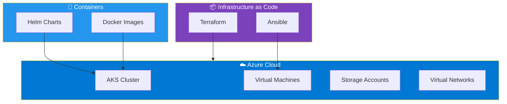

# 📚 Documentación de Infraestructura DevOps

Bienvenido al sistema de documentación automatizada para nuestra infraestructura.

!!! success "Documentación Siempre Actualizada"
    Esta documentación se genera automáticamente desde el código. **Garantiza 100% de sincronización** entre la infraestructura real y la documentación.

---

## 🚀 Inicio Rápido

<div class="grid cards" markdown>

- :material-terraform:{ .lg .middle } **Terraform**

    ---

    Módulos de infraestructura como código para Azure

    [:octicons-arrow-right-24: Ver Módulos](terraform/index.md)

- :material-ansible:{ .lg .middle } **Ansible**

    ---

    Roles para gestión de configuración de servidores

    [:octicons-arrow-right-24: Ver Roles](ansible/index.md)

- :material-kubernetes:{ .lg .middle } **Kubernetes**

    ---

    Helm Charts para despliegues en AKS

    [:octicons-arrow-right-24: Ver Charts](kubernetes/index.md)

- :material-docker:{ .lg .middle } **Docker**

    ---

    Aplicaciones containerizadas

    [:octicons-arrow-right-24: Ver Apps](docker/index.md)

</div>

---

## 📊 Stack Tecnológico



---

## 🔍 Búsqueda

Usa la barra de búsqueda en la parte superior para encontrar cualquier información rápidamente.

**Ejemplos de búsqueda:**

- `vpc` - Encuentra el módulo de VPC
- `nginx` - Encuentra el rol de webserver
- `helm` - Encuentra charts de Kubernetes
- `dockerfile` - Encuentra configuraciones Docker

---

## 📖 Secciones Principales

### Terraform

Módulos reutilizables de infraestructura para Azure:

- **[VPC](terraform/modules/vpc.md)** - Virtual Network y Subnets
- **[Storage](terraform/modules/storage.md)** - Storage Accounts y Blobs

### Ansible

Roles para configuración automatizada:

- **[Webserver](ansible/roles/webserver.md)** - NGINX web server
- **[Database](ansible/roles/database.md)** - PostgreSQL database

### Kubernetes

Helm Charts para orquestación:

- **[MyApp](kubernetes/helm/myapp.md)** - Aplicación principal

### Docker

Aplicaciones containerizadas:

- **[Backend](docker/apps/backend.md)** - API Node.js
- **[Frontend](docker/apps/frontend.md)** - Frontend con NGINX

---

## 🎯 Características del Sistema

!!! tip "Generación Automática"
    - **terraform-docs** genera documentación de módulos Terraform
    - **docsible** genera documentación de roles Ansible
    - **helm-docs** genera documentación de Helm charts
    - **Pre-commit hooks** mantienen la sincronización

!!! info "Diagramas Automáticos"
    Los diagramas de arquitectura se generan automáticamente desde el código:

    - Diagramas de dependencias Terraform
    - Diagramas de servicios Docker Compose
    - Diagramas de arquitectura Kubernetes

!!! warning "Validación Continua"
    Cada cambio es validado automáticamente:

    - Sintaxis de Terraform
    - Linting de Dockerfiles
    - Validación de manifests Kubernetes
    - Formato de documentación

---

## 🤝 Contribuir

Para actualizar esta documentación:

1. **Modifica el código** (Terraform, Ansible, Kubernetes, Docker)
2. **Haz commit** - Los pre-commit hooks actualizan la documentación automáticamente
3. **Push a main** - La documentación se publica automáticamente

!!! example "Ejemplo de Workflow"
    ```bash
    # 1. Modificar un módulo Terraform
    vim terraform/modules/vpc/main.tf

    # 2. Commit (terraform-docs se ejecuta automáticamente)
    git add .
    git commit -m "feat: add new subnet"

    # 3. Push (docs se publican automáticamente)
    git push origin main
    ```

---

## 📞 Soporte

- **Slack**: #devops-docs
- **Email**: <devops@empresa.com>
- **Wiki**: [Confluence Docs](https://wiki.empresa.com/devops)

---

## 📊 Métricas

!!! success "Ahorro de Tiempo"
    Este sistema ahorra **~32 horas/semana** al equipo al automatizar completamente la documentación.

**Última actualización**: Automático en cada commit
**Sincronización**: 100% garantizada con el código
